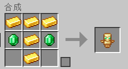
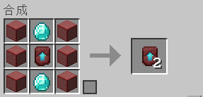
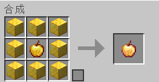
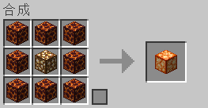
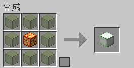
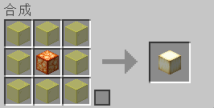
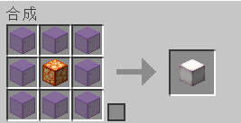
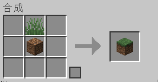
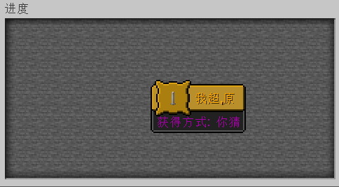

# 数据包

#### 介绍
HCN服务器所使用的数据包
由Hong_SZ所编写

#### 环境
Minecraft 1.17及以上

#### 安装教程

1.  放入datapacks
2.  输入/reload
3.  开始游玩

#### 使用说明

##### v1.0

##### v1.1

##### v1.2

更新打败坚守者凋落物

凋落物将会掉落:
- 腐肉 (45%概率)
- 钻石 (50%概率)
- 下届合金 (5%概率)

#### 新增进度

##### v1.0

